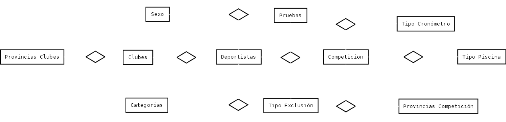

# Alternativa educativa

A pesar de que finalmente se utilizará una única tabla para la utilización del software, se ha desarrollado un esquema de base de datos relacional, que contempla el uso de múltiples tablas para el almacenaje de todos los datos.

Esta alternativa se utilizaría en el caso de que se quiera almacenar muchos datos para tener un histórico, en lugar de usar la tabla de forma temporal con los datos necesarios, los cuales posteriormente de generar el informe, serán borrados, como está planteado actualmente.

